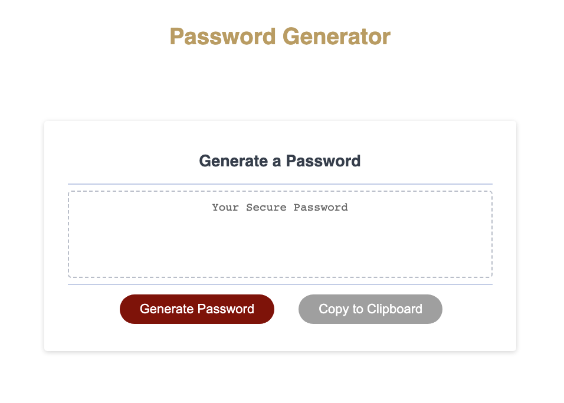

# Password Generator

## Table of Contennts

- [Description](#description)
- [Usage](#usage)
- [Deployed App](#deployed-app)

## Description

The Password Generator is an application that enables users to generate a random password based on criteria that they have selected. This will allow the user to create a stronger password that provides greater security.

## Usage

Head over to the [Password Generator](https://azs6189.github.io/password-generator/) webpage.

1. Click the `Generate Button` to begin generating your password. You will be given a series of prompts for password criteria.

2. Once you complete the prompts, your password will be generated.

3. You also have the option of copying your generated password to the clipboard.

## Built With

- HTML
- CSS
- JavaScript

## Deployed App

Link to deployed app: [Password Generator](https://azs6189.github.io/password-generator/)

